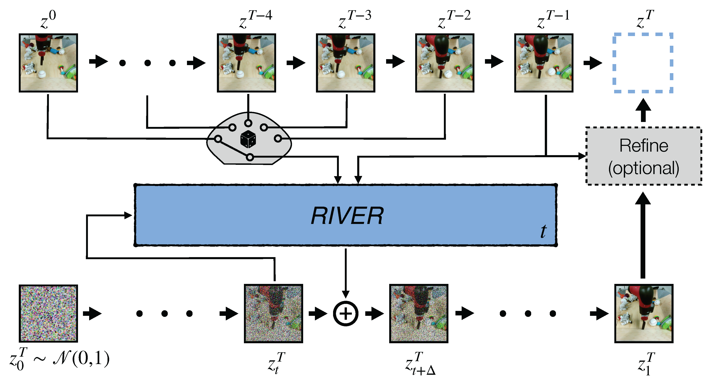

<h1 align="center">
  <br>
	<b>RIVER:</b> Efficient Video Prediction via Sparsely
  <br>
	Conditioned Flow Matching
  <br>
</h1>
  <p align="center">
    <a href="https://araachie.github.io">Aram Davtyan</a> •
    <a href="https://www.github.com/Separius">Sepehr Sameni</a> •
    <a href="https://www.cvg.unibe.ch/people/favaro">Paolo Favaro</a>
  </p>
<h4 align="center">Official repository of the paper</h4>

<h4 align="center">at ICCV 2023</h4>

<h4 align="center"><a href="https://araachie.github.io/river/">Website</a> • <a href="https://openaccess.thecvf.com/content/ICCV2023/html/Davtyan_Efficient_Video_Prediction_via_Sparsely_Conditioned_Flow_Matching_ICCV_2023_paper.html">Paper</a> • <a href="https://arxiv.org/abs/2211.14575">Arxiv</a>

<p float="left">
  
  
</p>

#
> **Abstract:** *We introduce a novel generative model for video
> prediction based on latent flow matching, an efficient alternative
> to diffusion-based models. In contrast to prior work,
> we keep the high costs of modeling the past during training
> and inference at bay by conditioning only on a small random
> set of past frames at each integration step of the image
> generation process. Moreover, to enable the generation
> of high-resolution videos and to speed up the training, we
> work in the latent space of a pretrained VQGAN. Finally,
> we propose to approximate the initial condition of the
> flow ODE with the previous noisy frame. This allows to reduce
> the number of integration steps and hence, speed up
> the sampling at inference time. We call our model Random
> frame conditioned flow Integration for VidEo pRediction,
> or, in short, RIVER. We show that RIVER achieves superior
> or on par performance compared to prior work on common
> video prediction benchmarks, while requiring an order of
> magnitude fewer computational resources.*

## Citation

	@InProceedings{Davtyan_2023_ICCV,
	    author    = {Davtyan, Aram and Sameni, Sepehr and Favaro, Paolo},
	    title     = {Efficient Video Prediction via Sparsely Conditioned Flow Matching},
	    booktitle = {Proceedings of the IEEE/CVF International Conference on Computer Vision (ICCV)},
	    month     = {October},
	    year      = {2023},
	    pages     = {23263-23274}
	}
  
## Prerequisites

For convenience, we provide an `environment.yml` file that can be used to install the required packages 
to a `conda` environment with the following command 

```conda env create -f environment.yml```

The code was tested with cuda=12.1 and python=3.9.

## Pretrained models

We share the weights of the models pretrained on the datasets considered in the paper.

<table style="margin:auto">
    <thead>
        <tr>
          <th>Dataset</th>
          <th>Resolution</th>
          <th>Training iterations</th>
          <th>Autoencoder</th>
          <th>Main model</th>
        </tr>
    </thead>
    <tbody>
        <tr>
            <td>BAIR 64</td>
            <td>64 x 64</td>
            <td>300k</td>
            <td><a href="https://huggingface.co/cvg-unibe/river_bair_64/blob/main/vqvae.ckpt">download</a></td>
            <td><a href="https://huggingface.co/cvg-unibe/river_bair_64/blob/main/model.pth">download</a></td> 
        </tr>
        <tr>
            <td>BAIR 256</td>
            <td>256 x 256</td>
            <td>130k</td>
            <td><a href="https://huggingface.co/cvg-unibe/river_bair_256/blob/main/vqvae.ckpt">download</a></td>
            <td><a href="https://huggingface.co/cvg-unibe/river_bair_256/blob/main/model.pth">download</a></td>
        </tr>
        <tr>
            <td>KTH</td>
            <td>64 x 64</td>
            <td>300k</td>
            <td><a href="https://huggingface.co/cvg-unibe/river_kth_64/blob/main/vqvae.ckpt">download</a></td>
            <td><a href="https://huggingface.co/cvg-unibe/river_kth_64/blob/main/model.pth">download</a></td>
        </tr>
        <tr>
            <td>CLEVRER</td>
            <td>128 x 128</td>
            <td>300k</td>
            <td><a href="https://huggingface.co/cvg-unibe/river_clevrer_128/blob/main/vqvae.pth">download</a></td>
            <td><a href="https://huggingface.co/cvg-unibe/river_clevrer_128/blob/main/model.pth">download</a></td>
        </tr>
    </tbody>
</table>

## Running pretrained models

To use a model that was trained with the code in this repository, 
you may utilize the `generate_frames` method of the model class.
Usage example:

```angular2html
from lutils.configuration import Configuration
from lutils.logging import to_video
from model import Model

config = Configuration(<path_to_config_file>)
model = Model(config["model"])
model.load_from_ckpt(<path_to_checkpoint_file>)
model.cuda()
model.eval()

generated_frames = model.generate_frames(
    initial_images.cuda(),  # of shape [b n c h w]
    num_frames=16,
    verbose=True)

generated_frames = to_video(generated_frames)
```

## Training your own models

To train your own video prediction models you need to start by preparing data. 

### Datasets

The training code expects the dataset to be packed into .hdf5 files in a custom manner. 
To create such files, use the provided `dataset/convert_to_h5.py` script. 
Usage example:

```angular2html
python dataset/convert_to_h5.py --out_dir <directory_to_store_the_dataset> --data_dir <path_to_video_frames> --image_size 128 --extension png
```

The output of `python dataset/convert_to_h5.py --help` is as follows:

```angular2html
usage: convert_to_h5.py [-h] [--out_dir OUT_DIR] [--data_dir DATA_DIR] [--image_size IMAGE_SIZE] [--extension EXTENSION]

optional arguments:
  -h, --help            show this help message and exit
  --out_dir OUT_DIR     Directory to save .hdf5 files
  --data_dir DATA_DIR   Directory with videos
  --image_size IMAGE_SIZE
                        Resolution to resize the images to
  --extension EXTENSION
                        Video frames extension

```

The video frames at `--data_dir` should be organized in the following way:

```angular2html
data_dir/
|---train/
|   |---00000/
|   |   |---00000.png
|   |   |---00001.png
|   |   |---00002.png
|   |   |---...
|   |---00001/
|   |   |---00000.png
|   |   |---00001.png
|   |   |---00002.png
|   |   |---...
|   |---...
|---val/
|   |---...
|---test/
|   |---...
```

To extract individual frames from a set of video files, we recommend using the `convert_video_directory.py` script from the [official PVG repository](https://github.com/willi-menapace/PlayableVideoGeneration#custom-datasets).

**BAIR:** Collect the dataset following instruction from the [official PVG repository](https://github.com/willi-menapace/PlayableVideoGeneration#preparing-datasets).

**KTH:** Download the videos from the [dataset's official website](https://www.csc.kth.se/cvap/actions/).

**CLEVRER:** Download the videos from the [official dataset's website](http://clevrer.csail.mit.edu/).

### Training autoencoder

We recommend to use the official [taming transformers repository](https://github.com/CompVis/taming-transformers) for 
training VQGAN. To use the trained VQGAN at the second stage, update the `model->autoencoder` field in the config accordingly. 
To do this, set `type` to `ldm-vq`, `config` to `f8_small`, `f8` or `f16` depending on the VQGAN config that was used at training.
We recommend using low-dimensional latents, e.g. from 4 to 8, and down-sampling images at least to 16 x 16 resolution. 

Besides, we also provide our own autoencoder architecture at `model/vqgan/vqvae.py` that one may use to train simpler VQVAEs.
For instance, our pretrained model on the CLEVRER dataset uses this custom implementation.

### Training main model

To launch the training of the main model, use the `train.py` script from this repository.
Usage example:

```angular2html
python train.py --config <path_to_config> --run-name <run_name> --wandb
```

The output of `python train.py --help` is as follows:

```angular2html
usage: train.py [-h] --run-name RUN_NAME --config CONFIG [--num-gpus NUM_GPUS] [--resume-step RESUME_STEP] [--vqvae-path VQVAE_PATH] [--random-seed RANDOM_SEED] [--wandb]

optional arguments:
  -h, --help            show this help message and exit
  --run-name RUN_NAME   Name of the current run.
  --config CONFIG       Path to the config file.
  --num-gpus NUM_GPUS   Number of gpus to use for training. By default uses all available gpus.
  --resume-step RESUME_STEP
                        Step to resume the training from.
  --random-seed RANDOM_SEED
                        Random seed.
  --wandb               If defined, use wandb for logging.
```

Use the configs provided in this repository as examples. 

### [Optional] Refinement network

To enhance the quality and the temporal consistency of the generated videos, one may additionally utilize 
the refinement network that takes 2 images as input and refines the second one based on the first. 
The training script for the refinement network is provided at `refinement/train.py`. `refinement` is a self-contained project that doesn't depend on the rest and can be trained separately from the main model.
However, you need to provide the path to existing pretrained VQGAN weights. Usage example:

```angular2html
 OMP_NUM_THREADS=1 torchrun --nproc_per_node=4 train.py --exp_name <experiment_name> --data_path <path_to_the_dataset_folder> --vqgan_path <path_to_vqgan_checkpoint>
```

For the training to work you additionally need to download the weights of the i3d network from [here](https://www.dropbox.com/s/ge9e5ujwgetktms/i3d_torchscript.pt?dl=1) and put them in the `refinement` folder.

Notice that we only used and tested the refinement network for the experiments on the BAIR 64 dataset, which is reflected in the code. To train on custom datasets, you might need to change the dataset class.
